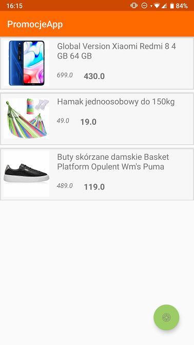

# PromocjeApp

Android app for sharing discounts.

## General info

PromocjeApp is a student project. It allows you to share with other users founded discounts. This app uses Google's Firebase for managing users and cloud database with yours discounts.

## Technologies

* Android studio 3.6.3
* Android SDK 23
* Firebase Firestore 21.4.3
* Firebase Auth 19.3.1
* Picasso 2.71828

## Setup

To setup a project, you need to clone the repository or download it's content and open up the main folder in Android Studio, version 3.6.3 or newer.

## Features

* Signing in
* Signing up
* Add new discount
* Scroll through the discounts
* Get more informations about items
* Open in browser url with discount

## Screenshots

